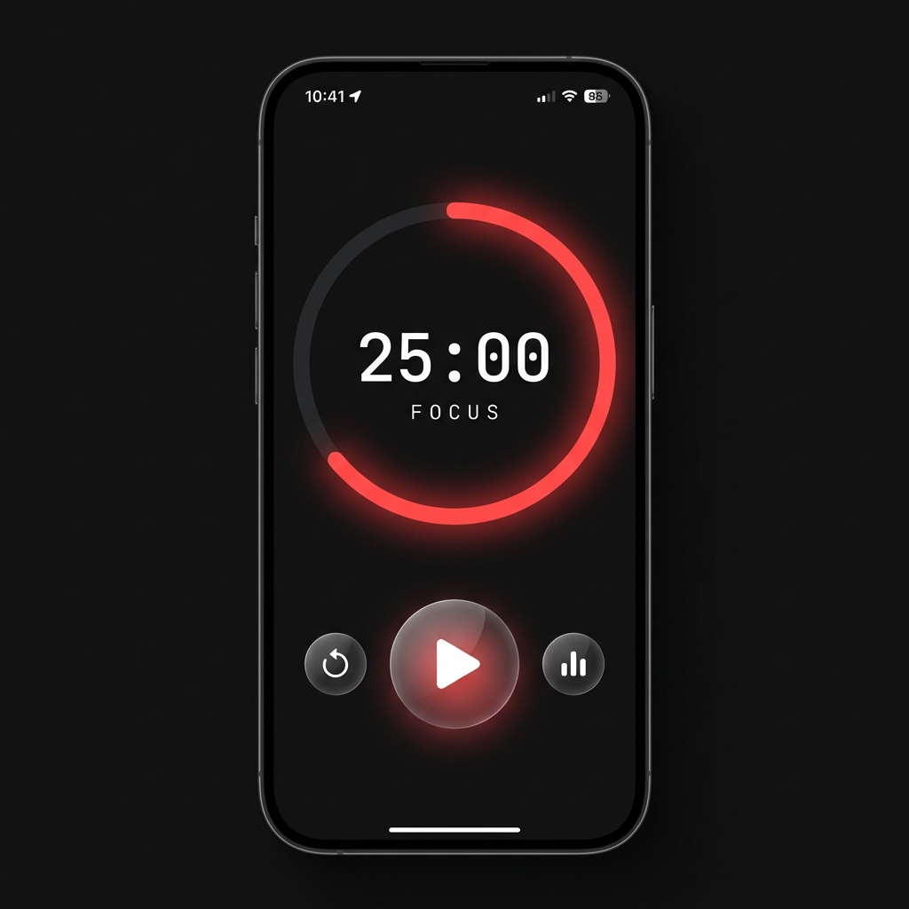

# Pomodoro Timer

A sleek, dark-themed Pomodoro Timer application built with React Native and Expo.



## Features

- **Customizable Timer**: Work, Break, and Long Break intervals.
- **Dark Mode**: Deep black background allowing for OLED power saving and reduced eye strain.
- **Visual Progress**: Circular progress indicator with vibrant animations.
- **Background Support**: Notifications and background timer support.
- **Task Management**: Simple task tracking to stay focused.

## Installation

1.  Clone the repository:
    ```bash
    git clone https://github.com/aswathm78/pomodoro-timer.git
    cd pomodoro-timer
    ```

2.  Install dependencies:
    ```bash
    npm install
    ```

3.  Run the app:
    ```bash
    npx expo start
    ```

## Building for Android

This project includes a GitHub Actions workflow to automatically build the Android APK.
Pushing to the `main` or `master` branch will trigger a build. The APK can be downloaded from the GitHub Actions run artifacts.

To build locally:

```bash
npx expo prebuild --platform android
cd android
./gradlew assembleDebug
```
